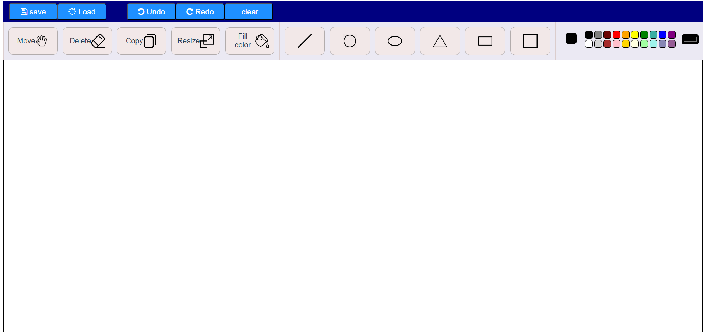
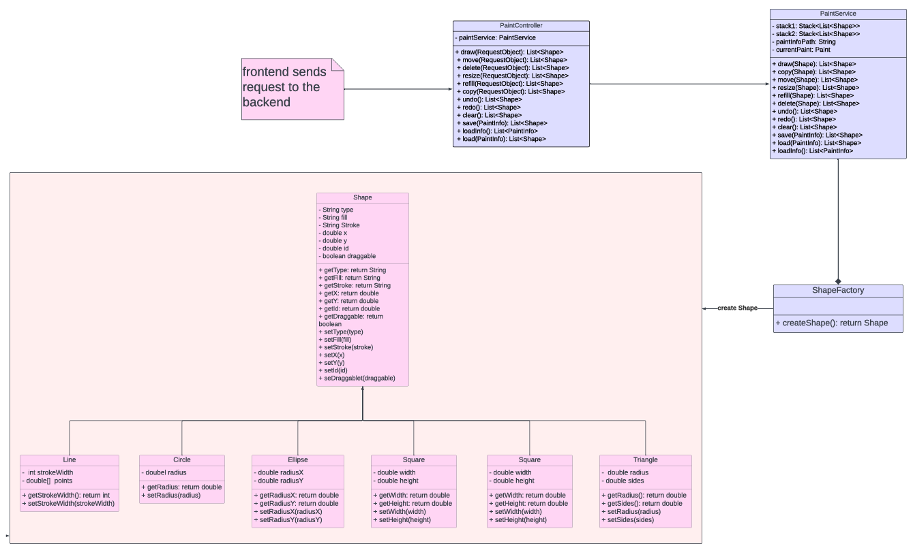

# Paint Website

## Project Overview
This digital painting website serves as an interactive platform for creating, modifying, and saving digital artworks. It offers a range of tools and features that enhance the user experience, enabling the creation of diverse shapes and patterns with custom colors.

## The Design

- **Minimalist Design**: The interface employs a minimalist approach with clear, straightforward icons that are easily recognizable. This simplicity makes it approachable for users of all skill levels.
- **Well-organized Layout**: Tools are neatly organized and grouped by functionality, such as drawing tools, editing tools, and file management options (save, load), which enhances usability.
- **Descriptive Icons**: The icons are descriptive and standard for such applications, such as the pencil for drawing, arrows for undo/redo, and the paint bucket for fill color, making them instantly recognizable.
- **Logical Grouping**: Tools are logically grouped together. For instance, shape tools are placed sequentially, and similarly, file operation tools (save and load) are located next to each other. This logical grouping helps users quickly find the tools they need without confusion.
- **Neutral Color Palette**: The use of a neutral color palette for the toolbars and buttons ensures that they don’t distract from the vibrant colors that might be used in the artwork itself. It also gives the application a professional look.
- **Dynamic Cursors**: The mention of dynamic cursors that change according to the tool selected can significantly enhance the user experience by providing visual feedback on the selected function, although this feature isn’t visible from the screenshot alone

## Design Patterns Used

### Factory Design Pattern

- **Implementation**: The `ShapeFactory` class is responsible for creating shape instances. It includes a `create` method that takes a `Map<String, Object>` as a parameter, which contains properties of the shape to be created.
- **Purpose**: This method determines the shape type based on the "type" property and uses a switch statement to instantiate the appropriate shape class like circle, square, etc. Additional properties are set based on the input map.

### Builder Design Pattern

- **Implementation**: Utilizing the `@builder` annotation from Lombok in shape classes. This simplifies the creation of object instances without the need to send all constructor parameters each time.
- **Purpose**: Facilitates the creation of shape instances with varying properties, offering flexibility and ease of object creation.

### Prototype Design Pattern

- **Implementation**: The base `Shape` class, from which all specific shapes inherit, is declared as an abstract class and implements the `Cloneable` interface.
- **Purpose**: Allows for cloning of shape instances, enabling the creation of new shapes based on existing ones without re-initialization.

## Design Decisions

- Modularized the project by implementing a `ShapeFactory` to handle instance creation.
- Each shape is encapsulated in its own class, inheriting from the `Shape` class.
- Introduced a `PaintController` to facilitate interactions with the frontend.
- Added a `RequestObject` class for handling incoming data via `@PostMapping` from the frontend.

## UML Class Diagram

## User Interface Features

### Drawing and Cursor Adaptability

- **Shapes**: Support for various shapes like lines, circles, rectangles, etc., drawn using the mouse.
- **Cursors**: Dynamic cursor adaptation to reflect different functionalities like drawing, erasing, or color filling.
- **Custom Colors**: Users can mix and create custom colors, applicable to any shape on the canvas.
- **Copy**: Enables users to duplicate selected shapes, aiding in pattern creation and design efficiency.
- **Move**: Allows free movement of shapes across the canvas with a "grip" cursor during the process.
- **Eraser**: Supports deletion of shapes upon contact with the eraser tool.
- **Resize**: Users can adjust shape dimensions, with validation for input values.
- **Fill Color**: Facilitates color application to existing shapes.
- Supports undoing and redoing actions through interface buttons or keyboard shortcuts (Ctrl+Z for undo, Ctrl+Y for redo).
- **Clear**: Provides a function to clear all shapes from the canvas, allowing users to start anew.

### Save and Load

- **Save**: Users can save their artwork by specifying a file path, name, and format (JSON or XML).
- **Load**: Offers a feature to load previously saved artworks by selecting from a list.

## Getting Started

To start using this project, clone the repository and follow the setup instructions in the documentation to install necessary dependencies and run the application.

### How To Run:

- First run the code of backend it will run automatically on port 8082
- Then run the code of front end by opening new terminal and typing in the terminal (npm
run serve) it will run on port 8080
- Then open the web and write in the URL (localhost:8080) or follow the link from VS
code
